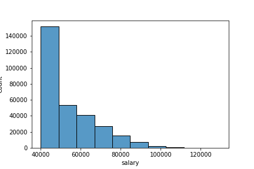

# SQL-challenge

Reconstructing a company's HR information database from CSV files using PostGreSQL, and querying the data for relevant data.  

### Entity Relationship Diagram
  

### Queries
 

### Additional Analysis

Based on initial analysis, the data does not apppear to be from a legitimate source, as the mean salaries for the different titles at the companies do not agree with the frequency distribution of salaries.   
  

If the average salaries for the different titles were indeed similar, we would not see a high variance in salary distribution. This suggests the titles may not be properly associated with salary.
